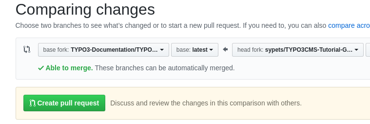

.. include:: ../Includes.txt
.. highlight:: rst

.. important::
   This is a draft and still needs to be refined!

.. _getting-started:

===============
Getting started
===============

.. _youtube-contribute-to-docs:

Youtube Tutorial - Contribute to docs.typo3.org
===============================================

Here is a video to get you started. Just make sure you come back here,
to read the rest of the guide afterwards.

2018-01-19 by Mathias Schreiber

.. youtube:: wNxO-aXY5Yw

Initial steps
=============

Edit me on Github
-----------------

The documentation is hosted on Github in a git repository for each manual.
When you click on the "Edit me on Github" button on the upper right of a
page, you are automatically directed to the corresponding file in the
Github repository.

Fork the repository
-------------------

Once you are there you will be asked to "Fork this repository and propose
changes". Do this. The repository will now be forked to your workspace,
which basically means making a copy.

.. note::
   The repository will be forked to your workspace on Github. You can
   delete it later or reuse it for further changes.

Choose a method!
================

Next you can make the changes and create a pull request.

All of this can be done either directly on Github or locally with
git / docker. We recommend to use the Github interface for small changes,
but make more significant changes locally.

If you are not familiar with using git, try the Github method first and
don't worry about the rest (yet). You can always come back to it at a
later point.

* Use :ref:`getting-started-github-simple` for minor changes in one file
* Use :ref:`getting-started-github-pro` if you are not familiar with
  git and want to make changes in more than one file
* Use :ref:`getting-started-git` if you are familiar with git and docker

.. _getting-started-github-simple:

Github method - simple
======================

You can edit the file directly within the Github user interface. Click on
the pencil icon to do this.

While you edit, you can switch to the preview view ("Preview changes")
to see what the end result will look like.

.. important::
   Keep in mind that the preview in Github may not always be correct
   because we have added some custom definitions. Try to adhere to
   the formatting rules that are already there. If in doubt, contact
   us in the #typo3-documentation channel on Slack. If you make
   significant changes, you may want to do the rendering locally,
   which will be explained later.

Once your changes are done and look ok, you can scroll to the bottom and look at
"Propose file change". There you will see 2 text fields which are for the commit
message title and commit message body. Type something meaningful in there
describing what you have changed. It is often enough, to type something in the
title.

.. note::
   Commit messages can be very simple. Use imperative form: "Fix typo". This is
   seen from the person, that is going to apply your patch: What will the patch do?
   Fix typo! See  `How to write a git commit message
   <https://chris.beams.io/posts/git-commit/>`__

When you are done, click on "Propose file change". You will now see the "Comparing
changes" page where you can click the green button "Create pull request".

.. _getting-started-github-pro:

Github method - pro
===================

If you are making changes to more than one file, try to create one
Pull Request for all changes.

.. fixme : find link for doing this

.. _getting-started-git:

Git / docker method
===================

git
---

If you are familiar with git and docker, you may prefer to use this
method. We will explain it only very briefly, because there are numerous
help pages for creating Pull Requests for Github and using docker online.

You will also fork the repository as described above.

Next you can use the common workflow for creating a Pull request on Github.

For example:

.. highlight:: bash

git clone
~~~~~~~~~

Clone the forked repository **from your workspace**, for example::

   git clone https://github.com/<USERNAME>/<NAME OF REPOSITORY>.git

Create branch
~~~~~~~~~~~~~

Create a branch, for example::

   git checkout -b changes-in-cgl

Make changes
~~~~~~~~~~~~

Using your preferred IDE or editor, make changes to the files. Make
sure you adhere to the Coding Guidelines for TYPO3 documentation, e.g.
use 3 spaces to indent (not tabs). 

.. todo: Add link to coding guidelines for our documentation

Render
~~~~~~

Render with docker in order to test the changes (see next section).

Commit
~~~~~~

::

   git commit -a

Push changes
~~~~~~~~~~~~

::

   git push origin changes-in-cgl

Create Pull request
~~~~~~~~~~~~~~~~~~~

Now, in your browser, visit the forked repository in your Github
workspace. Github will already make some suggestions for a Pull 
Request and will display your pushed branch as "Your recently 
pushed branches".

Now, click on the green button "Compare & pull request" and then
"Create pull request".

When you are done, you can navigate to the original repository
in the `TYPO3 documentation workspace
<https://github.com/TYPO3-Documentation>`__ by clicking on
the link shown as "Forked from" and check if your Pull Request
is visible in the list of pull requests.

For more information see the help pages on Github or other
resources, for example:

* `Creating a pull request from a fork
  <https://help.github.com/articles/creating-a-pull-request-from-a-fork/>`__
* `How to Create a Pull Request on GitHub
  <https://www.digitalocean.com/community/tutorials/how-to-create-a-pull-request-on-github>`__

docker
------

.. note::
   Some of these commands may not work on Windows. We are currently
   working on revising the documentation for Windows. If you are
   experiencing problems with this in any way, please contact us
   in the #typo3-documentation channel on Slack as described in the
   Introduction.

You should already have docker installed and usable.

docker pull
~~~~~~~~~~~

Now get the docker image for rendering TYPO3 documentation. You will
only need to do this once and occasionally update it::

   docker pull t3docs/render-documentation

source docker run
~~~~~~~~~~~~~~~~~

This command will make the command `dockrun_t3rdf makehtml` available in
your current shell. You will have to repeat it every time you reboot your
computer or open a new shell::

   source <(docker run --rm t3docs/render-documentation show-shell-commands)

dockrun_t3rdf
~~~~~~~~~~~~~

Now, in the directory of your cloned repository:

Run the rendering (you can repeat this as often as you want)::

   dockrun_t3rdf makehtml

Open the result in your browser, either by copy-pasting your current
directory and prepending it with `file:///` or with some other method,
and appending the path `Documentation-GENERATED-temp/typo3cms/drafts/project/0.0.0/Index.html`
e.g.::

   xdg-open "file:///$(pwd)/Documentation-GENERATED-temp/typo3cms/drafts/project/0.0.0/Index.html"

.. hint::
   Create command shortcuts for the basic commands, for example as aliases.

References:

* `Docker Render Documentation
  <https://github.com/t3docs/docker-render-documentation>`__
* `Render TYPO3 Documentation Guide
  <https://docs.typo3.org/typo3cms/RenderTYPO3DocumentationGuide/>`__
