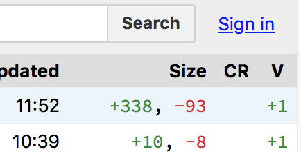

.. include:: ../Includes.txt

================================================
Drafts for visually structuring things on a page
================================================

Test out and showcase some ideas.

Adresses `PR for contribution guide
<https://github.com/TYPO3-Documentation/TYPO3CMS-Guide-ContributionWorkflow/issues/77>`__

Method: 1-2-3 with big numbers
==============================

first found in form extension docs: https://docs.typo3.org/typo3cms/extensions/form/QuickStart/Index.html

.. rst-class:: bignums-xxl

1. pro

   * good division between parts
   * numbering makes it easier to follow

2. con

   * not in menu, so you can't jump to specific section from menu

3. conlusion

   **Good method if there are not too many items (up to 7 is ok).**

Method: subsections
===================

pro:
----

division between subsection
~~~~~~~~~~~~~~~~~~~~~~~~~~~

subsection title in menu so you can click directly
~~~~~~~~~~~~~~~~~~~~~~~~~~~~~~~~~~~~~~~~~~~~~~~~~~

you can link directly to section with named anchors
~~~~~~~~~~~~~~~~~~~~~~~~~~~~~~~~~~~~~~~~~~~~~~~~~~~

con:
----

* no numbering

Methods: for images
===================

Adresses problem that it is difficult to distinguish images from text.

For demo with images, also see: https://docs.typo3.org/typo3cms/drafts/github/TYPO3-Documentation/t3SphinxThemeRtdDemoDocs/ImagesAndFigures/Index.html

Default
-------

With drop-shadow
----------------

sfsf sfdsfs
sdfsfds
sdfsfsdfsd  sdfdsfs sdfdsfdsfds sdfssd

sfsf sfdsfs
sdfsfds
sdfsfsdfsd  sdfdsfs sdfdsfdsfds sdfssd

sfsf sfdsfs
sdfsfds
sdfsfsdfsd  sdfdsfs sdfdsfdsfds sdfssd

sfsf sfdsfs
sdfsfds
sdfsfsdfsd  sdfdsfs sdfdsfdsfds sdfssd

sfsf sfdsfs
sdfsfds
sdfsfsdfsd  sdfdsfs sdfdsfdsfds sdfssd

sfsf sfdsfs
sdfsfds
sdfsfsdfsd  sdfdsfs sdfdsfdsfds sdfssd

With border
-----------

sfsf sfdsfs
sdfsfds
sdfsfsdfsd  sdfdsfs sdfdsfdsfds sdfssd

sfsf sfdsfs
sdfsfds
sdfsfsdfsd  sdfdsfs sdfdsfdsfds sdfssd

sfsf sfdsfs
sdfsfds
sdfsfsdfsd  sdfdsfs sdfdsfdsfds sdfssd

sfsf sfdsfs
sdfsfds
sdfsfsdfsd  sdfdsfs sdfdsfdsfds sdfssd

sfsf sfdsfs
sdfsfds
sdfsfsdfsd  sdfdsfs sdfdsfdsfds sdfssd

sfsf sfdsfs
sdfsfds
sdfsfsdfsd  sdfdsfs sdfdsfdsfds sdfssd

With border
-----------

sfsf sfdsfs
sdfsfds
sdfsfsdfsd  sdfdsfs sdfdsfdsfds sdfssd

sfsf sfdsfs
sdfsfds
sdfsfsdfsd  sdfdsfs sdfdsfdsfds sdfssd

sfsf sfdsfs
sdfsfds
sdfsfsdfsd  sdfdsfs sdfdsfdsfds sdfssd

sfsf sfdsfs
sdfsfds
sdfsfsdfsd  sdfdsfs sdfdsfdsfds sdfssd

sfsf sfdsfs
sdfsfds
sdfsfsdfsd  sdfdsfs sdfdsfdsfds sdfssd

sfsf sfdsfs
sdfsfds
sdfsfsdfsd  sdfdsfs sdfdsfdsfds sdfssd

sfsf sfdsfs
sdfsfds
sdfsfsdfsd  sdfdsfs sdfdsfdsfds sdfssd

sfsf sfdsfs
sdfsfds
sdfsfsdfsd  sdfdsfs sdfdsfdsfds sdfssd

sfsf sfdsfs
sdfsfds
sdfsfsdfsd  sdfdsfs sdfdsfdsfds sdfssd

sfsf sfdsfs
sdfsfds
sdfsfsdfsd  sdfdsfs sdfdsfdsfds sdfssd

sfsf sfdsfs
sdfsfds
sdfsfsdfsd  sdfdsfs sdfdsfdsfds sdfssd

sfsf sfdsfs
sdfsfds
sdfsfsdfsd  sdfdsfs sdfdsfdsfds sdfssd

With width and alignment (left)
-------------------------------

sfsf sfdsfs
sdfsfds
sdfsfsdfsd  sdfdsfs sdfdsfdsfds sdfssd

sfsf sfdsfs
sdfsfds
sdfsfsdfsd  sdfdsfs sdfdsfdsfds sdfssd

sfsf sfdsfs
sdfsfds
sdfsfsdfsd  sdfdsfs sdfdsfdsfds sdfssd

sfsf sfdsfs
sdfsfds
sdfsfsdfsd  sdfdsfs sdfdsfdsfds sdfssd

sfsf sfdsfs
sdfsfds
sdfsfsdfsd  sdfdsfs sdfdsfdsfds sdfssd

sfsf sfdsfs
sdfsfds
sdfsfsdfsd  sdfdsfs sdfdsfdsfds sdfssd

sfsf sfdsfs
sdfsfds
sdfsfsdfsd  sdfdsfs sdfdsfdsfds sdfssd

sfsf sfdsfs
sdfsfds
sdfsfsdfsd  sdfdsfs sdfdsfdsfds sdfssd

misc
----

sfsf sfdsfs
sdfsfds
 sdfsfsdfsd  sdfdsfs sdfdsfdsfds sdfssd

.. sidebar:: New to TYPO3 CMS?

   If you are new to TYPO3 CMS, please start by reading the
   :ref:`Tutorials <tutorials>`, which will help you progressively
   increase your knowledge of TYPO3 CMS.

   When you feel ready, you can move on to :ref:`Guides <guides>`,
   which provide an in-depth look into specific topics and
   :ref:`References <references>` which contain exhaustive listings
   of properties, options, APIs, etc.

.. End of sidebar

sdfsfs

.. container:: myclass

   text inside a container
   more text

the end
