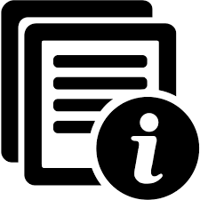
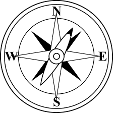

.. include:: ../../../Includes.txt

.. _drafts-visually-structure:

=======================
Startpage : With images
=======================

Title of document
=================

.. rst-class:: panel panel-default

About this manual
=================

This guide contains information about how to format the documentation
in reST. Specifically,

* how to write official TYPO3 documenation (on `docs.typo3.org <https://docs.typo3.org>`__)
* how to write documentation for extensions
* how to write documenation for the TYPO3 core.

.. rst-class:: panel panel-default

Additional information
======================

Find additional information:

* See the `t3SphinxThemeRtd demo docs
  <https://docs.typo3.org/typo3cms/drafts/github/TYPO3-Documentation/t3SphinxThemeRtdDemoDocs/Index.html>`__
  to find out about the visual appearance of various kind of markup.
* See `docker-render-documentation Readme on Github
  <https://github.com/t3docs/docker-render-documentation>`__ to
  find out how to use docker to render the TYPO3 documentation locally.

* *For extension developers:* Look at :ref:`how-to-start-docs-extension`

* *For TYPO3 core developers:* * Read :ref:`t3contribute:Bugfixing-Adding-documentation` to learn about how to add
  documentation to the Changelog

.. rst-class:: panel panel-default

How to read
===========

What are the some ways to get started reading this document?

* Use the **Quick start** section for a brief overview of the basic steps
* In section ... you will find help on ...
* In section ... you will find help on ...

