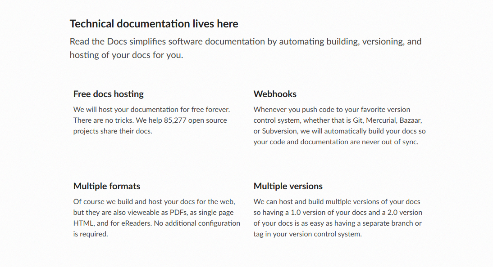

.. include:: ../../../Includes.txt

.. _drafts-visually-structure:

===================================
DRAFTS for startpage of each manual
===================================

What should be on the start page of each manual?

What information should be there?
=================================

Some examples:

* What's the manual about (short description)
* Target audience (e.g. Developers)
* Prerequisites (what knowledge do you need, what to read first)
* Recommended reading (or should this be in the introduction section?)
* How to read this document (or should this be in the introduction section?)
* Quick links

What information is already in left sidepanel, on footer etc. and must
not be in main content?

* Title of document (is in left sidepanel)
* Version of document (is in left sidepanel)
* Copyright (is in footer)
* Author : documentation team (is in footer)
* Rendered : is in footer

How should the start page be styled?
====================================

* e.g. use borders for each text block
* using multiple columns also looks nice.

* e.g. make text block with same information (e.g. what is manual about)
  easily recognizable
  by placing it at the top, using always the same image or style.
* e.g. use images for each text block
* e.g. always use specific styles (same color) for links

.. toctree::
   :maxdepth: 2
   :glob:
   :hidden:

   *