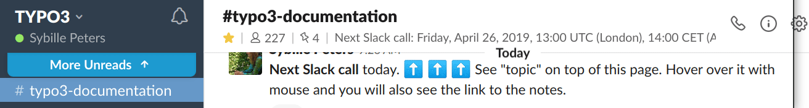

.. include:: ../Includes.txt

============================
Events, Sprints, Slack Calls
============================

Slack Calls
===========

There is a monthly Slack call in the **#typo3-documentation** channel.

Date:
   Every third Friday of the month
Time:
   14:00 CEST until 15:00 CEST (Berlin, Amsterdam)
Duration:
   One hour
Place:
   #typo3-documentation channel in Slack
Who can participate:
   everyone. You do not have to be a team member!
Direct link to Slack:
   https://typo3.slack.com

For more information about Slack, please see the `Wiki Slack page <https://wiki.typo3.org/Slack>`__,
to register, go to `Slack: my.typo3.org <https://my.typo3.org/about-mytypo3org/slack/>`__.

Next Slack Call
---------------

See "topic" in #typo3-documentation channel in Slack (topic is listed in the top, under the
channel name).

Past Slack Call Notes
---------------------

See `Forge Wiki <https://forge.typo3.org/projects/team-docteam/wiki/index>`__

Sprints
=======

Watch the events page: https://typo3.org/events

Currently, no sprints are planned.